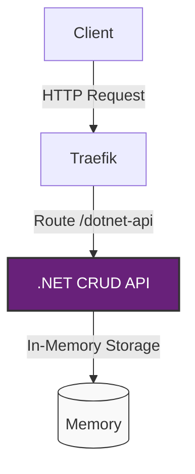

# .NET CRUD API in Nomad

This document describes the .NET CRUD API application running as an executable in Nomad.

## Overview

The .NET CRUD API is a simple in-memory CRUD (Create, Read, Update, Delete) API built with .NET 8 Minimal API. Unlike the Python web application which runs in a container, this API runs directly as an executable using Nomad's `exec` driver.

## Architecture



## Application Structure

The application is located in the `apps/dotnet-api` directory and has the following structure:

- `Program.cs` - Main application code with API endpoints
- `dotnet-api.csproj` - Project file with build settings
- `build.sh` - Script to build the application for Linux
- `README.md` - Documentation for the application

## API Endpoints

The API provides the following endpoints:

- `GET /` - Welcome message
- `GET /health` - Health check endpoint
- `GET /info` - System information
- `GET /api/items` - Get all items
- `GET /api/items/{id}` - Get item by ID
- `POST /api/items` - Create a new item
- `PUT /api/items/{id}` - Update an existing item
- `DELETE /api/items/{id}` - Delete an item

## Nomad Job Configuration

The Nomad job configuration for the .NET API is defined in `jobs/dotnet-api.nomad`. Key features include:

- Uses the `exec` driver to run the application as an executable
- Configures a health check on the `/health` endpoint
- Sets up Traefik routing with path prefix `/dotnet-api`
- Uses artifact stanza to fetch the executable from a local or remote source

## Deployment

The application is deployed using GitHub Actions workflow defined in `.github/workflows/deploy-dotnet-api.yml`. The workflow:

1. Builds the .NET application for Linux
2. Creates a ZIP artifact
3. Uploads the artifact to Azure Storage
4. Deploys the application to Nomad using the artifact URL

## Running Locally

To run the application locally:

1. Navigate to the `apps/dotnet-api` directory
2. Run `dotnet run` to start the application
3. Access the API at `http://localhost:5000`

## Accessing in Nomad

Once deployed to Nomad, the API can be accessed through Traefik at the path `/dotnet-api`. For example:

```
http://<nomad-cluster-ip>/dotnet-api/
```

Swagger UI is available at:

```
http://<nomad-cluster-ip>/dotnet-api/swagger
```
